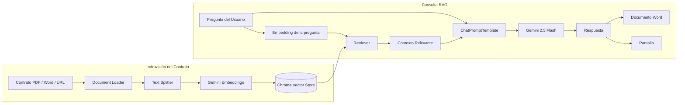
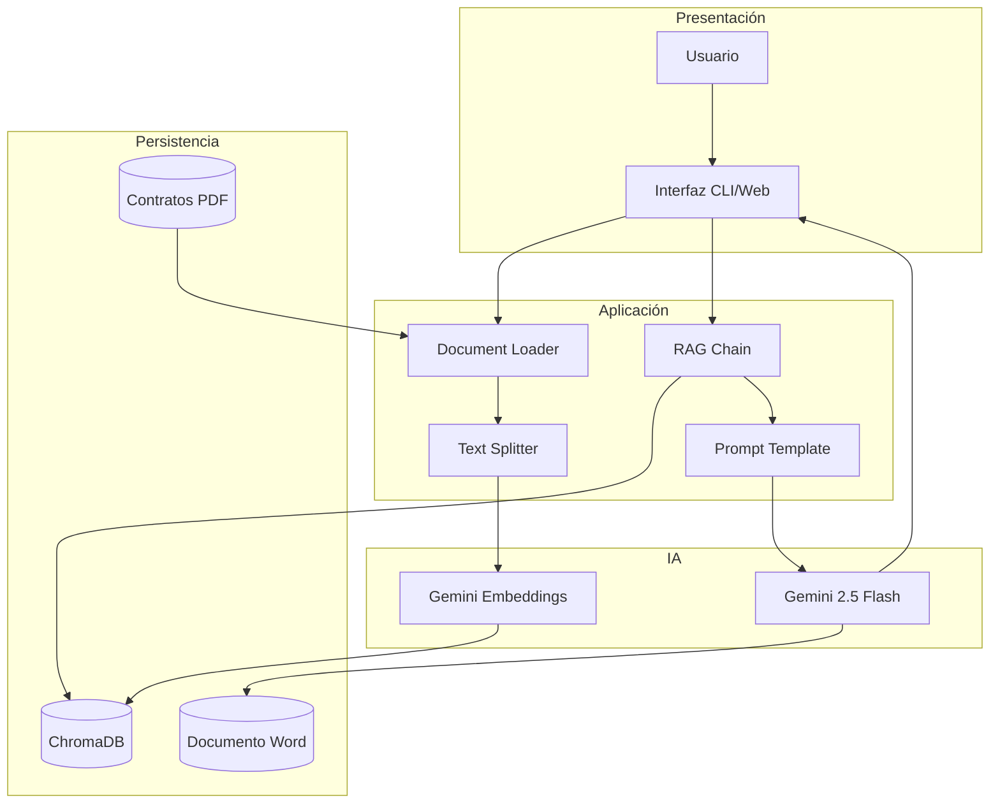
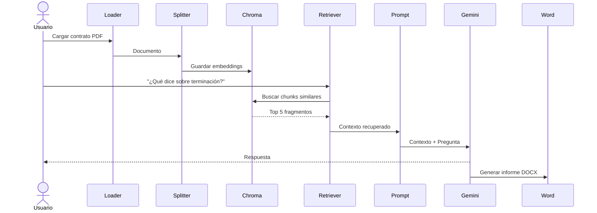

# Propuesta Completa: Asistente Legal para Análisis de Contratos

## 1. APLICACIÓN SELECCIONADA
**"Asistente Legal Automatizado para Análisis de Contratos"**
- Carga contratos (PDF, Word, web)
- Identifica cláusulas clave automáticamente
- Genera resúmenes por sección
- Responde preguntas específicas sobre términos
- Exporta análisis a documento Word

---

## 2. TRES COMPONENTES CLAVE DE LANGCHAIN

### **Componente 1: Document Loaders + Text Splitters**
```python
from langchain_community.document_loaders import PyPDFLoader, WebBaseLoader
from langchain_text_splitters import RecursiveCharacterTextSplitter

# Carga contratos desde múltiples fuentes
loader = PyPDFLoader("contrato.pdf")
documentos = loader.load()

# Divide en fragmentos mantenibles
splitter = RecursiveCharacterTextSplitter(
    chunk_size=1500,
    chunk_overlap=100
)
textos_split = splitter.split_documents(documentos)
```
**Por qué es clave:** Sin esto, no podrías procesar documentos largos. Los contratos suelen ser extensos y necesitan dividirse inteligentemente para RAG.

---

### **Componente 2: Vector Store + Retriever (Chroma)**
```python
from langchain_google_genai import GoogleGenerativeAIEmbeddings
from langchain_chroma import Chroma

# Vectoriza y almacena
embedding_model = GoogleGenerativeAIEmbeddings(model="models/gemini-embedding-001")
vector_store = Chroma.from_documents(
    textos_split,
    embedding_model,
    persist_directory="./contratos_db"
)

# Recupera cláusulas relevantes
retriever = vector_store.as_retriever(search_kwargs={"k": 5})
```
**Por qué es clave:** Permite búsquedas semánticas. Pregunta: "¿Qué dice sobre terminación?" y encuentra automáticamente la cláusula correcta sin búsquedas exactas.

---

### **Componente 3: Cadena RAG + ChatPromptTemplate**
```python
from langchain_core.prompts import ChatPromptTemplate
from langchain_google_genai import ChatGoogleGenerativeAI
from langchain_core.runnables import chain

# Define rol y estructura
mensaje_sistema = """Eres un abogado experto analizando contratos.
Proporciona análisis claros y precisos basados en el contexto del contrato.
Identifica riesgos potenciales y términos importantes."""

prompt = ChatPromptTemplate([
    ("system", mensaje_sistema),
    ("user", "Contrato: {contexto}\n\nPregunta: {pregunta}")
])

# Combina retriever + modelo
model = ChatGoogleGenerativeAI(model="gemini-2.5-flash", temperature=0)
chain_rag = prompt | model

# Función final
@chain
def analizar_contrato(pregunta: str):
    docs = retriever.invoke(pregunta)
    contexto = "\n".join([d.page_content for d in docs])
    return chain_rag.invoke({"contexto": contexto, "pregunta": pregunta})
```
**Por qué es clave:** Orquesta todo. Combina recuperación + generación + instrucciones específicas en una cadena reutilizable.

---

## 3. PRESENTACIÓN ESTRUCTURADA (5 minutos)

### **DIAPOSITIVA 1: Problema**
```
TÍTULO: "Análisis Manual de Contratos = Tiempo Perdido"

PROBLEMA:
❌ Abogados gastan 4-6 horas analizando 1 contrato
❌ Riesgo de perder cláusulas importantes
❌ Procesos inconsistentes
❌ Costos elevados

SOLUCIÓN: Asistente Legal IA Automatizado
```

### **DIAPOSITIVA 2: Arquitectura de Solución**
```
📄 INPUT (Contratos)
    ↓
🔪 Document Loader + Text Splitter
    ↓
🧬 Vector Store (Chroma) + Embeddings
    ↓
🔍 Retriever (Búsqueda Semántica)
    ↓
🤖 RAG Chain + ChatGPT
    ↓
📊 OUTPUT (Análisis + Documento Word)
```

### **DIAPOSITIVA 3: Componentes Clave**
```
1️⃣ DOCUMENT LOADERS
   - Carga PDFs, Word, URLs
   - Convierte cualquier formato → Documentos estructurados
   - Preserva metadatos (autor, fecha, página)

2️⃣ VECTOR STORE (CHROMA)
   - Almacena embeddings semánticos
   - Búsqueda: "¿Qué pasa si incumplo?" → encuentra cláusula
   - Sin coincidencias exactas necesarias

3️⃣ RAG CHAIN
   - Recupera contexto relevante
   - Lo alimenta al modelo con instrucciones
   - Genera análisis profesional consistente
```

### **DIAPOSITIVA 4: Demo Rápida**
```
PREGUNTA: "¿Cuál es el período de terminación?"

SISTEMA:
1. Busca en vector store → encuentra 5 fragmentos relevantes
2. Envía al modelo: "Basado en: [contexto]... responde:"
3. RESPUESTA: "El contrato especifica 30 días como período de 
   aviso previo para terminación, con compensación según..."

VENTAJA: Respuesta en 2 segundos con fuente
```

### **DIAPOSITIVA 5: Beneficios**
```
✅ VELOCIDAD: 4 horas → 5 minutos
✅ PRECISIÓN: Búsqueda semántica > búsqueda por palabras
✅ CONSISTENCIA: Mismo análisis cada vez
✅ ESCALABLE: Procesa 100 contratos automáticamente
✅ EXPORTABLE: Genera documento Word profesional
```

---

## 4. CÓDIGO EJECUTABLE (Versión Completa para Demo)

```python
# %%
!pip install langchain_community langchain_google_genai langchain-chroma python-docx

# %%
import os
import getpass
from docx import Document as wd
from langchain_core.prompts import ChatPromptTemplate
from langchain_google_genai import ChatGoogleGenerativeAI, GoogleGenerativeAIEmbeddings
from langchain_community.document_loaders import PyPDFLoader
from langchain_text_splitters import RecursiveCharacterTextSplitter
from langchain_chroma import Chroma
from langchain_core.runnables import chain

os.environ["GOOGLE_API_KEY"] = getpass.getpass("API Key: ")

# 1. CARGAR CONTRATO
loader = PyPDFLoader("contrato.pdf")  # Cambiar por tu PDF
documentos = loader.load()

# 2. DIVIDIR EN CHUNKS
splitter = RecursiveCharacterTextSplitter(chunk_size=1500, chunk_overlap=100)
textos_split = splitter.split_documents(documentos)

# 3. VECTORIZAR Y ALMACENAR
embedding_model = GoogleGenerativeAIEmbeddings(model="models/gemini-embedding-001")
vector_store = Chroma.from_documents(
    textos_split, 
    embedding_model,
    persist_directory="./contratos_db"
)
retriever = vector_store.as_retriever(search_kwargs={"k": 5})

# 4. CREAR CADENA RAG
mensaje_sistema = """Eres un abogado experto en análisis de contratos.
Proporciona análisis claros, precisos y basados en el contexto.
Identifica riesgos y términos clave. Sé profesional y detallado."""

prompt = ChatPromptTemplate([
    ("system", mensaje_sistema),
    ("user", "Contexto del contrato:\n{contexto}\n\nPregunta: {pregunta}")
])

model = ChatGoogleGenerativeAI(model="gemini-2.5-flash", temperature=0)

@chain
def analizar_contrato(pregunta: str):
    docs = retriever.invoke(pregunta)
    contexto = "\n---\n".join([d.page_content for d in docs])
    respuesta = (prompt | model).invoke({
        "contexto": contexto,
        "pregunta": pregunta
    })
    return respuesta.content

# 5. GENERAR DOCUMENTO
secciones = [
    "¿Cuáles son las principales cláusulas de este contrato?",
    "¿Cuál es el período de terminación y qué compensación aplica?",
    "¿Qué riesgos legales identifica en este contrato?",
    "¿Cuáles son los términos de pago y penalidades?"
]

doc = wd()
doc.add_heading("ANÁLISIS LEGAL AUTOMATIZADO", 0)

for seccion in secciones:
    doc.add_heading(seccion, level=1)
    resultado = analizar_contrato(seccion)
    doc.add_paragraph(resultado)

doc.save("Analisis_Contrato.docx")
print("✅ Documento generado: Analisis_Contrato.docx")

# 6. CONSULTAS INTERACTIVAS
print("\n🔍 Asistente Interactivo (escribe 'salir' para terminar)")
while True:
    pregunta = input("\n👤 Tu pregunta: ")
    if pregunta.lower() == "salir":
        break
    respuesta = analizar_contrato(pregunta)
    print(f"\n🤖 Respuesta:\n{respuesta}")
```

---

## 5. NOTAS PARA LA EXPOSICIÓN

| Tiempo | Contenido |
|--------|-----------|
| **0:00-0:30** | Mostrar el problema (Diapositiva 1) |
| **0:30-1:30** | Explicar arquitectura (Diapositivas 2-3) |
| **1:30-3:00** | Demo en vivo: cargar PDF y hacer 2 preguntas |
| **3:00-4:30** | Mostrar documento Word generado |
| **4:30-5:00** | Beneficios y conclusión |

---

## 6. EJEMPLOS DE PREGUNTAS PARA DEMO EN VIVO

```python
# Pregunta 1: Busca una cláusula específica
"¿Qué dice sobre confidencialidad?"

# Pregunta 2: Análisis de riesgos
"¿Hay cláusulas de indemnización? ¿Cuál es el límite?"

# Pregunta 3: Términos clave
"¿Cuál es la duración del contrato y cómo se renueva?"
```
--------------------------------------------------------------
La propuesta está bien estructurada y sigue el patrón clásico de una aplicación **RAG (Retrieval-Augmented Generation)** con **LangChain + Gemini + Chroma**. Sin embargo, la arquitectura puede representarse de forma más completa distinguiendo el **pipeline de indexación** (cuando se carga un contrato) del **pipeline de consulta** (cuando el usuario hace preguntas).

## Análisis de la arquitectura

La solución tiene dos flujos principales:

### 1. Flujo de Indexación (Offline)

Este flujo ocurre una sola vez por cada contrato.

1. El usuario carga un contrato (PDF, Word o URL).
2. LangChain utiliza un **Document Loader** para leer el contenido.
3. El **Text Splitter** divide el contrato en fragmentos (chunks).
4. Cada chunk se transforma en un embedding mediante Gemini Embeddings.
5. Los embeddings se almacenan en ChromaDB.

Este flujo prepara la base de conocimiento.

---

### 2. Flujo de Consulta (Online)

Cada vez que el usuario hace una pregunta:

1. La pregunta llega al sistema.
2. Se genera el embedding de la pregunta.
3. El Retriever busca los chunks más parecidos en Chroma.
4. Se construye el contexto.
5. El Prompt agrega:

   * Rol del abogado
   * Contexto recuperado
   * Pregunta del usuario
6. Gemini genera la respuesta.
7. La respuesta puede mostrarse en pantalla o exportarse a Word.

---

# Arquitectura Mermaid (Completa)



---

# Arquitectura por Capas

También puede verse como una arquitectura empresarial:



---

# Arquitectura de Secuencia

Para explicar el proceso durante la exposición, este diagrama muestra el intercambio de mensajes entre los componentes:



## Observaciones de diseño

La arquitectura sigue correctamente el patrón RAG, pero podría mejorarse con algunos componentes adicionales:

* **Capa de ingestión** para soportar múltiples formatos (PDF, DOCX, HTML, correo electrónico).
* **Persistencia de conversaciones** para mantener el historial del chat.
* **Memoria conversacional** de LangChain para preguntas de seguimiento.
* **Detección automática de cláusulas** como un paso previo al RAG.
* **Cache de embeddings** para evitar reprocesar el mismo contrato.
* **API (FastAPI)** entre la interfaz y la lógica RAG, facilitando la integración con aplicaciones web o móviles.

Para una presentación académica o profesional, el **primer diagrama (Indexación + Consulta RAG)** es el más recomendable, ya que refleja claramente el funcionamiento interno del sistema y separa los dos procesos fundamentales de una arquitectura RAG.
