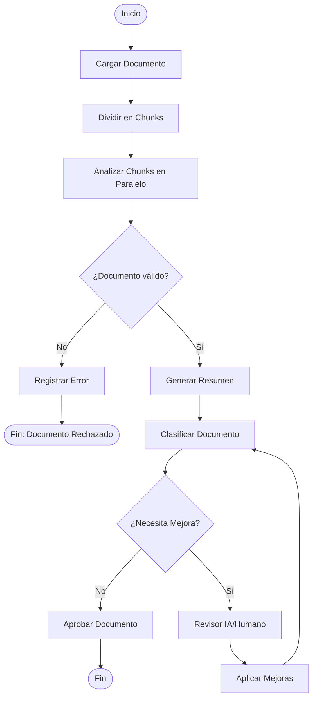
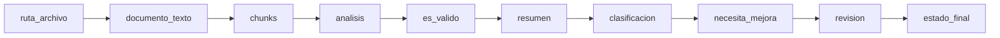
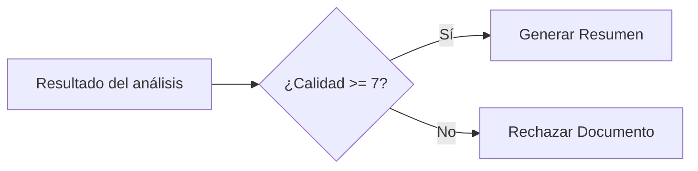
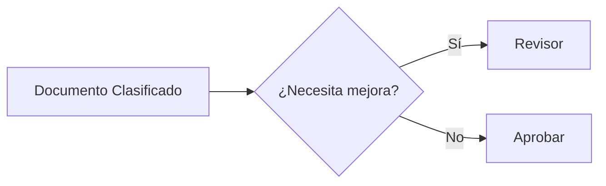
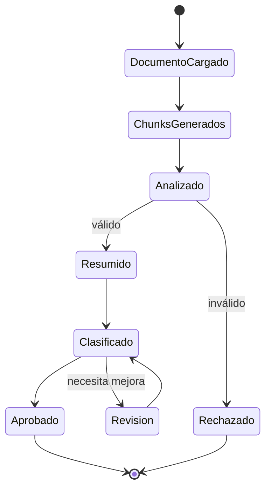
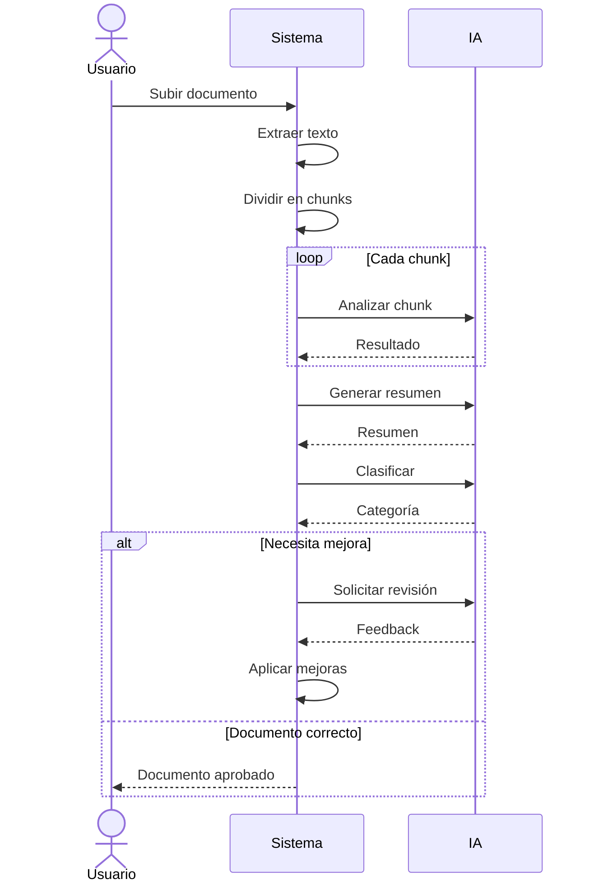

---

# Propuesta de Workflow

# Sistema Inteligente de Análisis y Validación de Documentos

## Objetivo

Diseñar un workflow que automatice el procesamiento de documentos mediante IA, realizando validación, análisis, clasificación y mejora iterativa antes de aprobar el documento.

---

# 1. Workflow General



---

# 2. Estado del Workflow

Durante la ejecución el sistema mantiene un objeto de estado que se va enriqueciendo.



Ejemplo del estado:

```python
EstadoDocumento = {
    "ruta_archivo": "",
    "documento_texto": "",
    "chunks": [],
    "analisis": {},
    "es_valido": False,
    "resumen": "",
    "clasificacion": "",
    "necesita_mejora": False,
    "revision": "",
    "estado_final": "",
    "intentos": 0
}
```

---

# 3. ¿Cómo se actualiza el estado?

| Paso              | Estado actualizado |
| ----------------- | ------------------ |
| Cargar Documento  | documento_texto    |
| Dividir en Chunks | chunks             |
| Analizar          | analisis           |
| Validar           | es_valido          |
| Generar Resumen   | resumen            |
| Clasificar        | clasificacion      |
| Revisar           | revision           |
| Aprobar           | estado_final       |
| Mejorar           | intentos + resumen |

---

# 4. Acciones de cada Nodo

## Nodo 1 – Cargar Documento

**Acción**

* Leer PDF
* Extraer texto

Actualiza:

```python
estado["documento_texto"] = texto
```

---

## Nodo 2 – Dividir en Chunks

**Acción**

Fragmentar el documento para permitir procesamiento paralelo.

Actualiza

```python
estado["chunks"] = dividir(texto)
```

---

## Nodo 3 – Analizar Chunks

Cada chunk es enviado a un modelo de IA.

Ejemplo de salida:

```python
estado["analisis"] = {
    "calidad":8.4,
    "errores":1,
    "temas":[...]
}
```

---

## Nodo 4 – Generar Resumen

Combina los resultados obtenidos.

```python
estado["resumen"] = resumen
```

---

## Nodo 5 – Registrar Error

Guarda el motivo del rechazo.

```python
estado["estado_final"]="RECHAZADO"
```

---

## Nodo 6 – Clasificar Documento

Clasifica el documento.

Ejemplo

* Técnico
* Legal
* Comercial
* Financiero

```python
estado["clasificacion"]="Técnico"
```

---

## Nodo 7 – Revisor

Puede ser:

* IA
* Humano
* Ambos

Genera recomendaciones.

```python
estado["revision"]=feedback
```

---

## Nodo 8 – Aprobar

```python
estado["estado_final"]="APROBADO"
```

---

## Nodo 9 – Aplicar Mejoras

Integra el feedback y vuelve a clasificar.

```python
estado["intentos"] += 1
```

---

# 5. Decisiones tomadas en las aristas

Las decisiones no ocurren en los nodos sino en las **aristas** (transiciones).

## Decisión 1



Regla

```python
if calidad >= 7:
    siguiente = "Generar Resumen"
else:
    siguiente = "Rechazar"
```

---

## Decisión 2



Regla

```python
if necesita_mejora:
    siguiente="Revisor"
else:
    siguiente="Aprobar"
```

---

# 6. Diagrama de Estados

Este diagrama muestra cómo evoluciona el workflow.



---

# 7. Diagrama de Secuencia

Representa cómo interactúan los componentes.



---

# 8. Respuesta a las preguntas del ejercicio

### ¿Cómo se actualiza el estado del workflow en cada paso?

Cada nodo agrega o modifica información del objeto `EstadoDocumento`. El estado viaja durante todo el flujo y almacena el progreso del documento, permitiendo que cada etapa utilice los resultados de la anterior.

---

### ¿Qué acción se ejecuta en cada nodo?

* Cargar documento
* Dividir en fragmentos
* Analizar con IA
* Generar resumen
* Clasificar
* Revisar
* Mejorar
* Aprobar o rechazar

---

### ¿Qué decisión se toma en cada arista?

**Arista 1**

¿El documento cumple el nivel mínimo de calidad?

* Sí → continúa.
* No → se rechaza.

**Arista 2**

¿El documento requiere mejoras?

* Sí → vuelve al revisor.
* No → se aprueba.

---

# Conclusión

Este workflow incorpora conceptos fundamentales de sistemas de procesos e IA:

* **Estados:** almacenan la información que evoluciona durante la ejecución.
* **Nodos:** representan tareas concretas (procesar, analizar, resumir, clasificar).
* **Aristas:** controlan el flujo mediante decisiones de negocio.
* **Ciclo de retroalimentación:** permite mejorar el documento antes de su aprobación, haciendo el proceso más robusto y cercano a implementaciones reales en motores de workflows como LangGraph o BPMN.

Este formato es ideal para una presentación de 5 minutos porque combina una explicación clara con diagramas visuales que facilitan entender el flujo completo.
