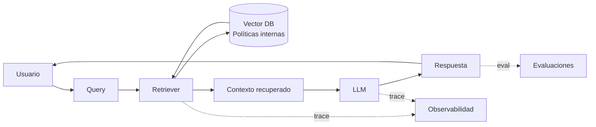
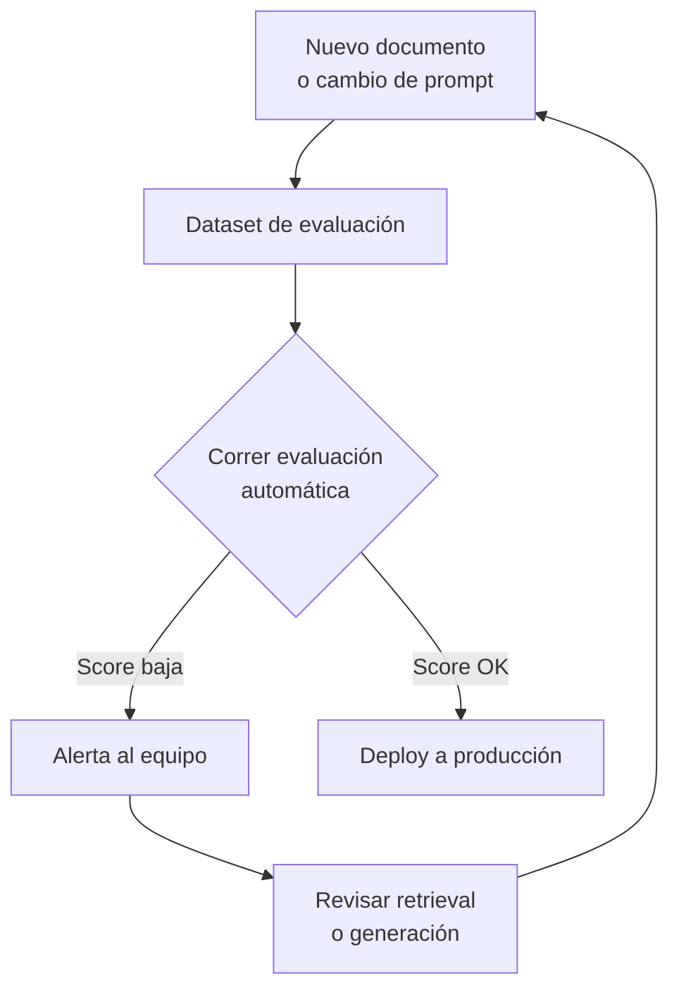

# Portada

# Sistema de Soporte Técnico con RAG
### Justificación de Observabilidad y Evaluaciones en producción

*Caso de uso: Chatbot de soporte bancario*

---

# 1. El problema

Un chatbot responde consultas sobre productos financieros usando
documentos internos de políticas (RAG - Retrieval Augmented Generation).

**¿Cómo sabemos si está funcionando bien... antes de que se entere el cliente?**

- Puede recuperar el documento equivocado
- Puede "alucinar" una respuesta que suena creíble pero es falsa
- Puede degradarse silenciosamente cuando se actualiza la base de conocimiento

---

# 2. Arquitectura del sistema



Dos capas críticas que **no son visibles al usuario**, pero determinan
si el sistema es confiable: la traza de cada paso (observabilidad) y
la medición de calidad (evaluaciones).

---

# 3. Observabilidad: ¿qué está pasando *ahora*?

- Verifica si se recuperó el documento correcto
- Detecta alucinaciones (respuesta sin respaldo documental)
- Aísla la falla: ¿fue el retrieval o la generación?
- Mide latencia por etapa

```python
from langsmith import traceable

@traceable(name="soporte_tecnico_rag")
def responder_consulta(pregunta: str):
    docs = retriever.invoke(pregunta)          # se traza automáticamente
    contexto = "\n".join(d.page_content for d in docs)

    respuesta = llm.invoke(
        f"Contexto:\n{contexto}\n\nPregunta: {pregunta}"
    )
    return respuesta  # latencia, tokens y pasos quedan en el dashboard
```

Cada llamada queda registrada: qué documentos entraron, qué prompt
se armó, qué devolvió el modelo y cuánto tardó cada paso.

---

# 4. Evaluaciones: ¿qué tan bien lo está haciendo?

- Precisión: respuesta obtenida vs. respuesta esperada
- Detecta degradación al agregar nuevos documentos
- Valida que no contradiga la base de conocimiento
- Mide consistencia en conversaciones de varias rondas

```python
from langsmith.evaluation import evaluate

def es_fiel_al_contexto(run, example):
    # compara la respuesta generada contra el documento fuente
    return {"score": chequear_fidelidad(run.outputs, example.outputs)}

evaluate(
    responder_consulta,
    data="dataset_soporte_bancario",   # preguntas + respuestas esperadas
    evaluators=[es_fiel_al_contexto],
)
```

---

# 5. Evaluación continua (CI para IA)



Cada cambio en la base documental o en el prompt dispara una
evaluación automática **antes** de llegar al cliente.

---

# 6. Sin vs. con observabilidad y evaluaciones

| Escenario | Sin observabilidad | Sin evaluaciones | Con ambas |
|---|---|---|---|
| Documento desactualizado | No se detecta el origen del error | Cliente recibe info errónea sin alerta | Se detecta automáticamente y se corrige antes del deploy |
| Nuevo prompt | No hay visibilidad del cambio de comportamiento | No hay forma de comparar calidad | Comparación objetiva contra baseline |

**Conclusión:** en un dominio financiero, donde un error de información
tiene costo real, observabilidad y evaluaciones no son opcionales —
son el mecanismo de control de calidad del sistema.